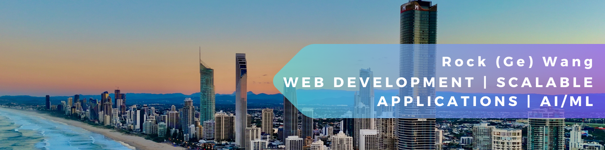

  

  <h1 align = left >👋 Hello there, I'm Rock! 🙋 </h1>

Welcome to my profile! As an aspiring Software Engineer with a solid foundation in ___web development, software engineering, and machine learning___, I have a passion for solving complex problems and building scalable applications. Eager to collaborate with diverse teams, I aim to contribute to impactful projects and push the boundaries of tech.

## 🛠 Skills 👨‍💻

### 1. &nbsp;🔧 Software Development 📱
- **Languages**:  &nbsp;  &nbsp;   &nbsp;
- **Frameworks**:  &nbsp;

### 2. &nbsp;🌐 Web Development 💻
- **Frontend**:  &nbsp;  &nbsp; &nbsp;  &nbsp;  &nbsp;  &nbsp;  &nbsp;  &nbsp;

- **Backend**:  &nbsp;  &nbsp; &nbsp;

- **Databases**:  &nbsp;  &nbsp; &nbsp;  &nbsp;  

- **Tools**: &nbsp;  &nbsp;  &nbsp; 
### 3. &nbsp;🧠 Machine Learning 🤖
- **Frameworks**:  &nbsp;   &nbsp; &nbsp;

- **Experience**: Neural network training, optimization, predictive modeling, computer vision.

### 4. &nbsp;📊 Data Analysis 🧐
- **Libraries**:  &nbsp; &nbsp; 

- **Experience**: Data manipulation and analysis.

### 5. &nbsp; 💬 LLM APIs and Model Localization 😶‍🌫️
- **APIs**: &nbsp;   &nbsp;  
- **Transformers**: &nbsp;  &nbsp; 
- **Platforms**: &nbsp; 
- **Experience**: Proficient in utilizing LLM APIs for integrating conversational AI into applications, fine-tuning transformer models (BERT/DistilBERT) for domain-specific tasks, and localizing models using platforms like Ollama for on-device or private cloud deployment.

### 6. &nbsp;📋 Project Management 🗂️
- **Methodologies**: Agile, Scrum 
- **Experience**: Leading projects, coordinating teams, meeting deadlines.

## 🛠 Project Experience 📑

  

- **Engineered** an advanced web scraper leveraging **LLM** Ollama gpt-oss:20b for intelligent data parsing, extracting and processing content from over **500** web pages on-premise with enhanced precision and performance.
- **Developed** a responsive **Streamlit** interface with real-time progress tracking, sidebar configuration, and visual indicators for seamless user experience in URL input, scraping, and data parsing.
- **Implemented** smart content cleaning and intelligent chunking algorithms using **BeautifulSoup** and **lxml**, significantly reducing data extraction errors and improving content processing efficiency.
- **Architected** modular code structure with enhanced error handling, logging capabilities, export functionality, and configurable processing parameters for robust and reliable operation.

  

- **Architected** and developed a comprehensive spatial data pipeline for an accessibility-focused mapping application serving Sydney, processing **76,000+** data points across **15+** datasets including building complexes, transportation networks, and accessibility infrastructure.
- **Implemented** multi-service **Docker** architecture using Docker Compose to orchestrate **Elasticsearch**, **PostgreSQL** (GNAF), **Redis**, and **Flask** services, enabling scalable data processing and real-time spatial data visualization.
- **Engineered** automated data indexing system with **Elasticsearch**, supporting both point and polygon geometries, with dynamic mapping configurations for heterogeneous spatial datasets (GeoJSON, EPSG4326 projections).
- **Developed** real-time API integration pipeline using **APScheduler** for hourly pedestrian count data updates from ArcGIS REST services, implementing robust error handling and data transformation workflows.
- **Built** Flask-based microservices architecture including GNAF address search API with **Celery/Redis** task queuing, Elasticsearch search API with geospatial filtering, and live bus tracking indexer for dynamic transportation data.
- **Optimized** spatial query performance through bounding box filtering, bulk indexing strategies, and efficient Elasticsearch mappings, reducing query response times and enabling responsive interactive map interfaces.

  

- **Developed** an advanced multiclass fraud detection system using **BERT** and **DistilBERT** transformers, achieving **97%** accuracy in classifying 9 distinct fraud types including phishing, tech support scams, and job scams alongside legitimate messages.
- **Engineered** comprehensive machine learning pipeline with traditional ML baselines (TF-IDF + Logistic Regression/SVM) and state-of-the-art transformer models, implementing **DistilBERT** for **60% faster training** while maintaining **97% of BERT's performance**.
- **Optimized** for **Kaggle GPU training** with memory-efficient data loaders, batch processing, and automated model checkpointing, reducing training time and enabling scalable deployment for real-time fraud detection systems.
- **Implemented** production-ready inference demos with interactive command-line and **Jupyter notebook** interfaces, featuring confidence scoring, batch prediction capabilities, and comprehensive evaluation metrics for cybersecurity applications.
- **Architected** robust data preprocessing pipeline handling imbalanced multiclass datasets with **stratified sampling**, **label encoding**, and **cross-validation** strategies to ensure reliable model performance across all fraud categories.
  

  

- **Conceptualized** and built a web application to boost visibility and streamline administrative
functions for volunteer groups, featuring user sign-ups, location management, event creation,
and role-based profile management.
- **Spearheaded** the **database schema design** and led the development of the user
management module, ensuring efficient data storage, retrieval, and seamless frontend
integration for effective role and access management.
- **Implemented** secure authentication mechanisms using **Argon2** for password hashing and
**Google OAuth** for third-party login.
- **Coordinated** with frontend and backend teams to achieve a **20%** reduction in development
  time ahead of schedule.
- **Performed** comprehensive testing and debugging to ensure high performance and user
satisfaction.

  

- **Created and honed** a model for detecting football players in videos with the **YOLOv5**
framework for training and **YOLOv8** for inference, achieving **92%** accuracy.
- **Sourced and pre-processed** a dataset of **663** annotated images from Roboflow, enhancing
model precision.
- **Leveraged** **Google Colab**’s GPU resources for efficient model training and tuning, reaching
**97.5%** precision in generating real-time bounding boxes around detected players.
- Minimized manual video analysis time by **85%** through model performance optimizations.

  

-	**Developed** a weather application using SwiftUI, providing real-time weather updates based on user location.
- **Integrated** CoreLocation to fetch and manage user location data for accurate weather information.
- **Implemented** a responsive UI with animated loading and launch screens to enhance user experience.
- **Utilized** the OpenWeather API to fetch reliable and up-to-date weather data.
- **Designed** custom views and extensions for streamlined UI components and improved code reusability.
- **Conducted** thorough testing and debugging to ensure application stability and performance.

  

- **Developed** a semantic segmentation pipeline for autonomous driving scenes using **PyTorch**.
- **Implemented** custom data loaders, augmentation strategies, and advanced network architectures to boost segmentation accuracy.
- **Conducted** ablation studies and tracked results with mIoU and FLOPs metrics for model efficiency.
- **Documented** findings and methods in a comprehensive report, highlighting improvements over the baseline.

 
   

- **Engineered** a reinforcement learning agent using **Deep Q-Networks (DQN)** to autonomously play Flappy Bird, achieving high scores and advancing through increasing difficulty levels.
- **Refined** the agent's state representation and reward function, leveraging game environment parameters (e.g., bird position, pipe gap, velocity) to optimize learning and decision-making.
- **Implemented** experience replay and target network updates for stable and efficient training, following best practices from modern RL research.
- **Utilized** PyTorch for neural network modeling and training, ensuring scalable and reproducible experiments.
- **Validated** agent performance across multiple game levels, with automated evaluation and model checkpointing for robust benchmarking.

## 🎓 Education 📖
**Bachelor of Information Technology**: February 2023 – Present  
*University of Adelaide*  
- **Relevant coursework**:  
  - Artificial Intelligence Technologies (_Distinction_)
  - Computer Systems  
  - Object-Oriented Programming  
  - Programming for IT Specialists (_Distinction_)  
  - Web & Database Computing (_Distinction_)  
  - Introduction to Applied Programming (_High Distinction_)  
  - Introduction to Computer Systems, Networks, and Security (_High Distinction_)
  - Database and Ethical Data
  - Secure Programming
  - Using Machine Learning Tools
  - Computer Vision

## 📜 Certification 🏆
- **[HackerRank Software Engineer Certificate](https://www.hackerrank.com/certificates/iframe/1d18ed03135b)**  
  *Credential ID: 1D18ED03135B*  
  - Skills: Problem-solving, Python programming, SQL databases, REST APIs  
  - Issued: September 2024

## 📈 GitHub Stats 📊

  

  

  

## 🔗 Connect with Me 🕸️
Thanks for stopping by! Feel free to check out my repositories and get in touch if you’re interested in collaborating on any projects.

  &nbsp;&nbsp;&nbsp;&nbsp;&nbsp;&nbsp;&nbsp;&nbsp;
  
    &nbsp;&nbsp;&nbsp;&nbsp;&nbsp;&nbsp;&nbsp;&nbsp;

  

  

