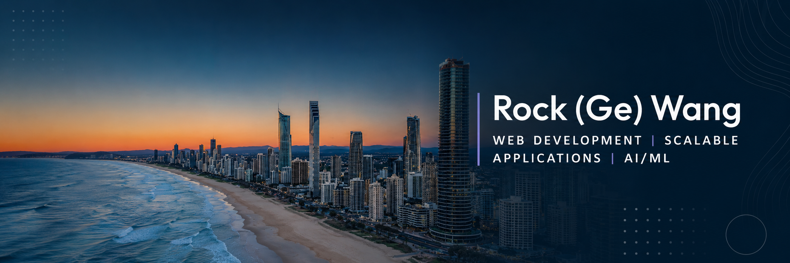

<p align="center">
  
</p>

<p align="center">
  <a href="https://github.com/RockENZO">
    
  </a>
</p>

<p align="center">
  
  
  
</p>

---

### 🧭 About me

```ts
const rock = {
  studying:  "Bachelor of IT @ University of Adelaide",
  focus:     ["Web Development", "Scalable Applications", "AI / ML"],
  building:  "data pipelines, explainable NLP and local-first AI tools",
  certified: "HackerRank Software Engineer (2024)",
  askMeAbout: ["React & Vue", "PyTorch", "Elasticsearch", "Docker"],
};
```

### ⚡ Tech stack

<p align="center">
  <b>Languages</b><br/><br/>
  
</p>
<p align="center">
  <b>Frontend &amp; backend</b><br/><br/>
  
</p>
<p align="center">
  <b>Data &amp; infrastructure</b><br/><br/>
  
</p>
<p align="center">
  <b>Machine learning &amp; LLMs</b><br/><br/>
  
  <br/>
  
  
  
  
  
  
</p>

---

### 🚀 Featured projects

<table>
  <tr>
    <td width="50%" valign="top">
      <a href="https://github.com/RockENZO/datapipeline-etl"></a>
      <br/><b>Knia Maps.</b> Geospatial ETL behind an accessibility map of Sydney: <b>76,000+</b> points from 15+ datasets on Elasticsearch, PostgreSQL, Redis and Flask.
    </td>
    <td width="50%" valign="top">
      <a href="https://github.com/RockENZO/NLP-Cyber-Harm-Detection"></a>
      <br/><b>CSIRO's Data61.</b> Explainable scam detection across 10 threat types, from BERT at <b>94%</b> to a BART model that explains its call.
    </td>
  </tr>
  <tr>
    <td width="50%" valign="top">
      <a href="https://github.com/RockENZO/data"></a>
      <br/><b>CSIRO's Data61.</b> <b>194,914</b> scam and legitimate samples from 23 sources across email, SMS, popups and dialogue.
    </td>
    <td width="50%" valign="top">
      <a href="https://github.com/RockENZO/Automatic-web-scraper-with-LLM-parsing"></a>
      <br/>Messy web pages in, clean structured data out, via a local Ollama model. Tested on <b>500+</b> pages.
    </td>
  </tr>
  <tr>
    <td width="50%" valign="top">
      <a href="https://github.com/RockENZO/MyWeather"></a>
      <br/>SwiftUI weather app with live location, smooth animations and OpenWeatherMap data.
    </td>
    <td width="50%" valign="top">
      <a href="https://github.com/RockENZO/ML-object-detection-project"></a>
      <br/>YOLOv5/v8 finds players in match video at <b>97.5%</b> precision, cutting manual review by 85%.
    </td>
  </tr>
</table>

<details>
<summary><b>More projects</b></summary>
<br/>

- [Odyssey](https://github.com/RockENZO/odyssey): a local-first coding agent for your terminal, 17 tools on Ollama with no cloud
- [MagicTrick](https://github.com/RockENZO/MagicTrick): an iOS card trick with no buttons, only rotate, shake and a secret tap
- [ControllerMouse](https://github.com/RockENZO/ControllerMouse): drive your Mac's cursor with a game controller from the menu bar
- [Road semantic segmentation](https://github.com/RockENZO/Road_Semantic_Segmentation_CV): PyTorch segmentation for driving scenes, with mIoU and FLOPs ablations
- [Flappy Bird DQN](https://github.com/RockENZO/flappy_bird_dqn-main): a DQN agent that learns to play Flappy Bird
- [Feed the World](https://github.com/RockENZO/Feed-the-world-web-app): volunteer-group web app (team project)

</details>

---

### 🎓 Education &amp; certification

- **Bachelor of Information Technology**, University of Adelaide (2023 to present). High Distinctions in Applied Programming and in Computer Systems, Networks &amp; Security; Distinctions in AI Technologies, Web &amp; Database Computing and Programming for IT Specialists.
- **[HackerRank Software Engineer](https://www.hackerrank.com/certificates/iframe/1d18ed03135b)** (Sep 2024): problem solving, Python, SQL, REST APIs.

---

### 📊 GitHub activity

<p align="center">
  
  
</p>

<p align="center">
  
</p>

<p align="center">
  
</p>

<p align="center">
  <picture>
    <source media="(prefers-color-scheme: dark)" srcset="https://raw.githubusercontent.com/RockENZO/RockENZO/output/github-contribution-grid-snake-dark.svg" />
    
  </picture>
</p>

---

### 🤝 Let's connect

<p align="center">
  <a href="https://github.com/RockENZO"></a>
  <!-- Add more once confirmed, e.g. LinkedIn / email / portfolio -->
</p>

<p align="center">
  <a href="https://spotify-github-profile.kittinanx.com/api/view?uid=31fxyxpn2nphks7upu5gtfwptfl4&redirect=true">
    
  </a>
</p>


